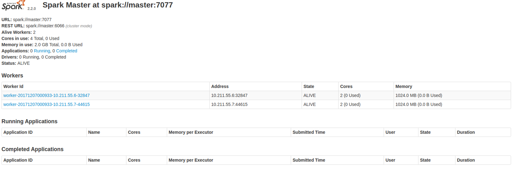
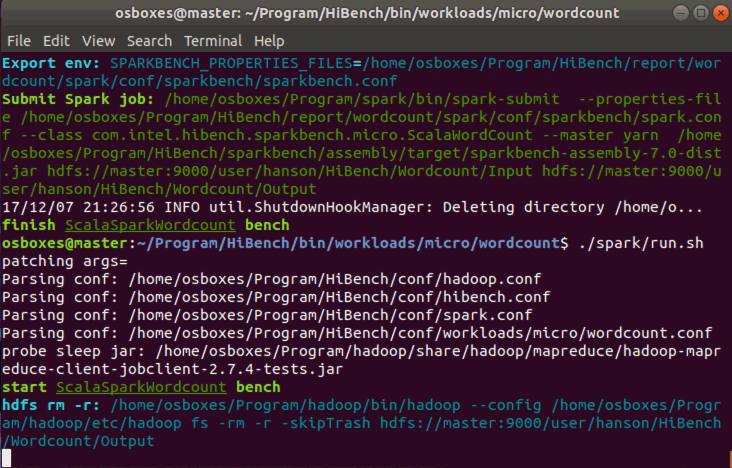

# Tools installation
Before You start this installation guide, please install hadoop first.
## install scala
go to `~/Program` directory
```bash
wget https://scala-lang.org/files/archive/scala-2.10.4.tgz
tar -xzvf scala-2.10.4.tgz
mv scala-2.10.4.tgz scala
```

## Setting up environment for scala
add following line to `~/.bashrc` file.
```bash
export SCALA_HOME=$WORK_SPACE/scala
export PATH=$PATH:$SCALA_HOME/bin
```

## Verifying the scala installation
```bash
source .bashrc
scala -version
```

## Install Spark
```bash
cd /usr/local
sudo wget http://mirrors.ocf.berkeley.edu/apache/spark/spark-2.2.0/spark-2.2.0-bin-hadoop2.7.tgz
tar -zxvf spark-2.2.0-bin-hadoop2.7.tgz
mv spark-2.2.0-bin-hadoop2.7 spark
```
## Setting up environment for spark
add following line to `~/.bashrc` file.
```bash
export SPARK_HOME=$WORK_SPACE/spark
export PATH=$PATH:$SCALA_HOME/bin
```
then go to `spark/conf` folder
```
export SCALA_HOME=~/Program/scala
export JAVA_HOME=$(readlink -f /usr/bin/java | sed "s:bin/java::")
export HADOOP_HOME=~/Program/hadoop
export HADOOP_CONF_DIR=$HADOOP_HOME/etc/hadoop

# This is important, spark-shell will report `WARN util.NativeCodeLoader: Unable to load native-hadoop library for your platform... using builtin-java classes where applicable` if lack following cmd.
export LD_LIBRARY_PATH=~/Program/hadoop/lib/native

SPARK_LOCAL_DIRS=~/Program/spark

```
## Verifying the Spark Installation
Write the following command for opening Spark shell.
```bash
$spark-shell
```
If spark is installed successfully then you will find the following output.

```bash
SSpark context Web UI available at http://10.211.55.3:4040
Spark context available as 'sc' (master = local[*], app id = local-1512005367714).
Spark session available as 'spark'.
Welcome to
____              __
/ __/__  ___ _____/ /__
_\ \/ _ \/ _ `/ __/  '_/
/___/ .__/\_,_/_/ /_/\_\   version 2.2.0
/_/

Using Scala version 2.11.8 (OpenJDK 64-Bit Server VM, Java 1.8.0_151)
Type in expressions to have them evaluated.
Type :help for more information.
scala>
```

You can use following command to test spark:
```bash
osboxes@hanson:~$ run-example SparkPi 2>&1 | grep "Pi is roughly"
Pi is roughly 3.1406157030785153

```
Then go to `spark/sbin/start-all.sh` to start Spark.
check `jps`
```bash
osboxes@hanson:~/Program/spark/sbin$ jps
24946 SecondaryNameNode
21462 DataNode
3431 Worker
21578 ResourceManager
21323 NameNode
21836 NodeManager
3231 Master
3503 Jps
```
You should see `Master` and `Worker` process.

You can also go to http://localhost:8080 to see spark management page.


run following command to test:
```
run-example SparkPi 10 --master local[2]
```
The output should look like this:
```bash
osboxes@hanson:~/Program/spark/sbin$ run-example SparkPi 10 --master local[2]
17/11/30 20:59:28 INFO spark.SparkContext: Running Spark version 2.2.0
17/11/30 20:59:29 INFO spark.SparkContext: Submitted application: Spark Pi
17/11/30 20:59:29 INFO spark.SecurityManager: Changing view acls to: osboxes
17/11/30 20:59:29 INFO spark.SecurityManager: Changing modify acls to: osboxes
17/11/30 20:59:29 INFO spark.SecurityManager: Changing view acls groups to:
17/11/30 20:59:29 INFO spark.SecurityManager: Changing modify acls groups to:
17/11/30 20:59:29 INFO spark.SecurityManager: SecurityManager: authentication disabled; ui acls disabled; users  with view permissions: Set(osboxes); groups with view permissions: Set(); users  with modify permissions: Set(osboxes); groups with modify permissions: Set()
17/11/30 20:59:29 INFO util.Utils: Successfully started service 'sparkDriver' on port 32771.
...
17/11/30 20:59:31 INFO executor.Executor: Adding file:/home/osboxes/Program/spark/spark-3cb6e513-4f4a-4766-8db7-19edff37ca92/userFiles-b3d61850-be50-41f8-a93d-0041caa6688a/scopt_2.11-3.3.0.jar to class loader
17/11/30 20:59:31 INFO executor.Executor: Fetching spark://10.211.55.3:32771/jars/spark-examples_2.11-2.2.0.jar with timestamp 1512097169906
17/11/30 20:59:31 INFO util.Utils: Fetching spark://10.211.55.3:32771/jars/spark-examples_2.11-2.2.0.jar to /home/osboxes/Program/spark/spark-3cb6e513-4f4a-4766-8db7-19edff37ca92/userFiles-b3d61850-be50-41f8-a93d-0041caa6688a/fetchFileTemp1574408171749093577.tmp
17/11/30 20:59:31 INFO executor.Executor: Adding file:/home/osboxes/Program/spark/spark-3cb6e513-4f4a-4766-8db7-19edff37ca92/userFiles-b3d61850-be50-41f8-a93d-0041caa6688a/spark-examples_2.11-2.2.0.jar to class loader
17/11/30 20:59:31 INFO executor.Executor: Finished task 2.0 in stage 0.0 (TID 2). 867 bytes result sent to driver
17/11/30 20:59:31 INFO scheduler.TaskSetManager: Starting task 4.0 in stage 0.0 (TID 4, localhost, executor driver, partition 4, PROCESS_LOCAL, 4825 bytes)
...
17/11/30 20:59:32 INFO storage.BlockManager: BlockManager stopped
17/11/30 20:59:32 INFO storage.BlockManagerMaster: BlockManagerMaster stopped
17/11/30 20:59:32 INFO scheduler.OutputCommitCoordinator$OutputCommitCoordinatorEndpoint: OutputCommitCoordinator stopped!
17/11/30 20:59:32 INFO spark.SparkContext: Successfully stopped SparkContext
17/11/30 20:59:32 INFO util.ShutdownHookManager: Shutdown hook called
17/11/30 20:59:32 INFO util.ShutdownHookManager: Deleting directory /home/osboxes/Program/spark/spark-3cb6e513-4f4a-4766-8db7-19edff37ca92
```
## Install Maven
```
wget http://ftp.wayne.edu/apache/maven/maven-3/3.5.2/binaries/apache-maven-3.5.2-bin.tar.gz
tar -xzvf apache-maven-3.5.2-bin.tar.gz
mv apache-maven-3.5.2 maven
```

Add `Maven` to `PATH`. Add following command to `~/.bashrc`

```bash
export $MAVEN_HOME=~/Program/maven
export PATH=$PATH:$MAVEN_HOME/bin
```
testing:
```bash
osboxes@hanson:~/Program/maven/bin$ ./mvn -v
Apache Maven 3.5.2 (138edd61fd100ec658bfa2d307c43b76940a5d7d; 2017-10-18T02:58:13-05:00)
Maven home: /home/osboxes/Program/maven
Java version: 1.8.0_151, vendor: Oracle Corporation
Java home: /usr/lib/jvm/java-8-openjdk-amd64/jre
Default locale: en_US, platform encoding: UTF-8
OS name: "linux", version: "4.13.0-17-generic", arch: "amd64", family: "unix"
```
`Note:` Ubuntu 17.10 has maven 3.5.0 installed in path `/usr/bin/mvn`

# Install Hibench
## Download
Go to https://github.com/intel-hadoop/HiBench to download Hibench source code. Right now the newest version of Hibench is `Hibench-7.0`.

## Build
mvn -Phadoopbench -Psparkbench -Dspark=2.2 -Dscala=2.11 clean package
```bash
[INFO] Reactor Summary:
[INFO]
[INFO] hibench ............................................ SUCCESS [  2.752 s]
[INFO] hibench-common ..................................... SUCCESS [ 59.408 s]
[INFO] HiBench data generation tools ...................... SUCCESS [ 14.577 s]
[INFO] sparkbench ......................................... SUCCESS [  0.006 s]
[INFO] sparkbench-common .................................. SUCCESS [ 15.951 s]
[INFO] sparkbench micro benchmark ......................... SUCCESS [  3.666 s]
[INFO] sparkbench machine learning benchmark .............. SUCCESS [ 12.743 s]
[INFO] sparkbench-websearch ............................... SUCCESS [  2.864 s]
[INFO] sparkbench-graph ................................... SUCCESS [  6.133 s]
[INFO] sparkbench-sql ..................................... SUCCESS [  7.039 s]
[INFO] sparkbench-streaming ............................... SUCCESS [  4.415 s]
[INFO] sparkbench project assembly ........................ SUCCESS [ 10.047 s]
[INFO] hadoopbench ........................................ SUCCESS [  0.002 s]
[INFO] hadoopbench-sql .................................... SUCCESS [ 40.980 s]
[INFO] mahout ............................................. SUCCESS [01:13 min]
[INFO] PEGASUS: A Peta-Scale Graph Mining System .......... SUCCESS [  2.299 s]
[INFO] nutchindexing ...................................... SUCCESS [01:06 min]
[INFO] ------------------------------------------------------------------------
[INFO] BUILD SUCCESS
[INFO] ------------------------------------------------------------------------
[INFO] Total time: 05:22 min
[INFO] Finished at: 2017-12-01T15:11:52-06:00
[INFO] Final Memory: 54M/423M
```

## Configuration
Go go `Hibench/conf/` directory.
```
cp conf/hadoop.conf.template conf/hadoop.conf
```
Set the below properties properly:

```
# Hadoop home
hibench.hadoop.home    ~/Program/hadoop

# The path of hadoop executable
hibench.hadoop.executable     ${hibench.hadoop.home}/bin/hadoop

# Hadoop configraution directory
hibench.hadoop.configure.dir  ${hibench.hadoop.home}/etc/hadoop

# The root HDFS path to store HiBench data
# Port should be same as the configuration in ~/Program/hadoop/etc/hadoop/core-site.xml
# datafolder should be where your store your data. Here I set as `/user/hanson`, so mine is hdfs://localhost:9000/user/hanson
hibench.hdfs.master       hdfs://master_hostname:port/datafolder

# Hadoop release provider. Supported value: apache, cdh5, hdp
hibench.hadoop.release    apache
```

## Run Hadoop Hibench
first you should start hadoop. Go to master machine's  `~/Program/hadoop/sbin`, run following commands:
```bash
./start-dfs.sh
./start-yarn.sh
```
make sure hadoop run normally.
```bash
#### standalone mode
osboxes@hanson:~$ jps
3184 DataNode
3669 ResourceManager
2982 NameNode
11896 Jps
3434 SecondaryNameNode
4013 NodeManager

#### multinode
# master side
osboxes@hanson:~$ jps
3669 ResourceManager
2982 NameNode
11896 Jps
3434 SecondaryNameNode

# slave side
osboxes@slave2:~/Program/hadoop/tmp/dfs$ jps
6012 Jps
2702 DataNode
2927 NodeManager
```

Run:
```
bin/workloads/micro/wordcount/prepare/prepare.sh
bin/workloads/micro/wordcount/hadoop/run.sh
```
In standalone mode, you will encounter error:
```bash
assert 0, "Get workers from yarn-site.xml page failed, reason:%s\nplease set `hibench.masters.hostnames` and `hibench.slaves.hostnames` manually" % e
AssertionError: Get workers from yarn-site.xml page failed, reason:Unknown resourcemanager, please check `hibench.hadoop.configure.dir` and "yarn-site.xml" file
please set `hibench.masters.hostnames` and `hibench.slaves.hostnames` manually
/home/osboxes/Program/HiBench/bin/functions/workload_functions.sh: line 38: .: filename argument required
.: usage: . filename [arguments]
```
So you should go to `~Program/Hibench/conf/hibench.conf` file.
and edit:
```
hibench.masters.hostnames localhost:9000 # This should be the same as the value of `fs.defaultFS` in your `core-site.xml`, (multinode: hibench.masters.hostnames master)
hibench.slaves.hostnames localhost:9000 # (multinode: hibench.slaves.hostnames slave1 slave2)
```
prepare.sh


run.sh


If everything works fine, then you will find a `report` folder in your `~Program/Hibench/` directory.
```bash
~/Program/Hibench
--| hibench.conf
--| wordcount
----| hadoop
------| bench.log
------| conf
--------| ...
----| prepare
...
```

Also there will be a report on DFS:
```bash
osboxes@hanson:~/Program/HiBench$ fs -ls /user/hanson/HiBench/Wordcount/Output
Found 9 items
-rw-r--r--   1 osboxes supergroup          0 2017-12-03 01:15 /user/hanson/HiBench/Wordcount/Output/_SUCCESS
-rw-r--r--   1 osboxes supergroup       2696 2017-12-03 01:15 /user/hanson/HiBench/Wordcount/Output/part-r-00000
-rw-r--r--   1 osboxes supergroup       2577 2017-12-03 01:15 /user/hanson/HiBench/Wordcount/Output/part-r-00001
-rw-r--r--   1 osboxes supergroup       2629 2017-12-03 01:15 /user/hanson/HiBench/Wordcount/Output/part-r-00002
-rw-r--r--   1 osboxes supergroup       2952 2017-12-03 01:15 /user/hanson/HiBench/Wordcount/Output/part-r-00003
-rw-r--r--   1 osboxes supergroup       2858 2017-12-03 01:15 /user/hanson/HiBench/Wordcount/Output/part-r-00004
-rw-r--r--   1 osboxes supergroup       2700 2017-12-03 01:15 /user/hanson/HiBench/Wordcount/Output/part-r-00005
-rw-r--r--   1 osboxes supergroup       2719 2017-12-03 01:15 /user/hanson/HiBench/Wordcount/Output/part-r-00006
-rw-r--r--   1 osboxes supergroup       3025 2017-12-03 01:15 /user/hanson/HiBench/Wordcount/Output/part-r-00007
```

You can see your test results in `report/wordcount/hadoop/bench.log`
```bash
osboxes@hanson:~/Program/HiBench/report/wordcount/prepare$ cat bench.log
17/12/01 21:31:35 INFO Configuration.deprecation: session.id is deprecated. Instead, use dfs.metrics.session-id
17/12/01 21:31:35 INFO jvm.JvmMetrics: Initializing JVM Metrics with processName=JobTracker, sessionId=
Running 8 maps.
Job started: Fri Dec 01 21:31:36 CST 2017
17/12/01 21:31:36 INFO jvm.JvmMetrics: Cannot initialize JVM Metrics with processName=JobTracker, sessionId= - already initialized
17/12/01 21:31:36 INFO mapreduce.JobSubmitter: number of splits:1
17/12/01 21:31:36 INFO mapreduce.JobSubmitter: Submitting tokens for job: job_local953690831_0001
17/12/01 21:31:36 INFO mapreduce.Job: The url to track the job: http://localhost:8080/
17/12/01 21:31:36 INFO mapreduce.Job: Running job: job_local953690831_0001
17/12/01 21:31:36 INFO mapred.LocalJobRunner: OutputCommitter set in config null
17/12/01 21:31:36 INFO output.FileOutputCommitter: File Output Committer Algorithm version is 1
17/12/01 21:31:36 INFO mapred.LocalJobRunner: OutputCommitter is org.apache.hadoop.mapreduce.lib.output.FileOutputCommitter
17/12/01 21:31:36 INFO mapred.LocalJobRunner: Waiting for map tasks
17/12/01 21:31:36 INFO mapred.LocalJobRunner: Starting task: attempt_local953690831_0001_m_000000_0
17/12/01 21:31:36 INFO output.FileOutputCommitter: File Output Committer Algorithm version is 1
17/12/01 21:31:36 INFO mapred.Task:  Using ResourceCalculatorProcessTree : [ ]
17/12/01 21:31:36 INFO mapred.MapTask: Processing split: hdfs://localhost:9000/HiBench/Wordcount/Input/dummy-split-0:0+1
17/12/01 21:31:36 INFO mapred.LocalJobRunner:
17/12/01 21:31:36 INFO mapred.Task: Task:attempt_local953690831_0001_m_000000_0 is done. And is in the process of committing
17/12/01 21:31:36 INFO mapred.LocalJobRunner:
17/12/01 21:31:36 INFO mapred.Task: Task attempt_local953690831_0001_m_000000_0 is allowed to commit now
17/12/01 21:31:36 INFO output.FileOutputCommitter: Saved output of task 'attempt_local953690831_0001_m_000000_0' to hdfs://localhost:9000/HiBench/Wordcount/Input/_temporary/0/task_local953690831_0001_m_000000
17/12/01 21:31:36 INFO mapred.LocalJobRunner: done with 8 records.
17/12/01 21:31:36 INFO mapred.Task: Task 'attempt_local953690831_0001_m_000000_0' done.
17/12/01 21:31:36 INFO mapred.LocalJobRunner: Finishing task: attempt_local953690831_0001_m_000000_0
17/12/01 21:31:36 INFO mapred.LocalJobRunner: map task executor complete.
17/12/01 21:31:37 INFO mapreduce.Job: Job job_local953690831_0001 running in uber mode : false
17/12/01 21:31:37 INFO mapreduce.Job:  map 100% reduce 0%
17/12/01 21:31:37 INFO mapreduce.Job: Job job_local953690831_0001 completed successfully
17/12/01 21:31:37 INFO mapreduce.Job: Counters: 22
File System Counters
FILE: Number of bytes read=297802
FILE: Number of bytes written=599873
FILE: Number of read operations=0
FILE: Number of large read operations=0
FILE: Number of write operations=0
HDFS: Number of bytes read=0
HDFS: Number of bytes written=4914
HDFS: Number of read operations=4
HDFS: Number of large read operations=0
HDFS: Number of write operations=3
Map-Reduce Framework
Map input records=1
Map output records=8
Input split bytes=124
Spilled Records=0
Failed Shuffles=0
Merged Map outputs=0
GC time elapsed (ms)=0
Total committed heap usage (bytes)=173015040
org.apache.hadoop.examples.RandomTextWriter$Counters
BYTES_WRITTEN=4721
RECORDS_WRITTEN=8
File Input Format Counters
Bytes Read=0
File Output Format Counters
Bytes Written=4914
Job ended: Fri Dec 01 21:31:37 CST 2017
The job took 1 seconds.
```

## Run Spark HiBench
Go to master machine's `~/Program/Spark/conf/` folder, edit file `slaves`:
```bash
slave1
slave2
```
Then use command:
```
scp -r slaves osboxes@slave2:/home/osboxes/Program/spark/conf/
```
to send configure file to all slaves

Start Spark:
```
~/Program/Spark/sbin/start-all.sh
```

Then in the master machine, we should have a `Master`:
```
osboxes@master:~/Program/spark/sbin$ jps
2818 NameNode
8729 Master
8826 Jps
3099 SecondaryNameNode
3327 ResourceManager
```

In the slave machine, we should have a `Worker`:
```bash
osboxes@slave2:~/Program/hadoop/tmp/dfs$ jps
6981 Worker
7429 Jps
2702 DataNode
2927 NodeManager
```

Go to http://master:8080 to see your running state.


You could now run a spark cluster example:
```
spark-submit \
--class org.apache.spark.examples.SparkPi \
--master yarn \
./examples/jars/spark-examples_2.11-2.2.0.jar \
10
```
Output should be like this:
```bash
17/12/07 00:24:18 INFO spark.SparkContext: Running Spark version 2.2.0
17/12/07 00:24:18 INFO spark.SparkContext: Submitted application: Spark Pi
17/12/07 00:24:18 INFO spark.SecurityManager: Changing view acls to: osboxes
17/12/07 00:24:18 INFO spark.SecurityManager: Changing modify acls to: osboxes
17/12/07 00:24:18 INFO spark.SecurityManager: Changing view acls groups to:
17/12/07 00:24:18 INFO spark.SecurityManager: Changing modify acls groups to:
17/12/07 00:24:18 INFO spark.SecurityManager: SecurityManager: authentication disabled; ui acls disabled; users  with view permissions: Set(osboxes); groups with view permissions: Set(); users  with modify permissions: Set(osboxes); groups with modify permissions: Set()
17/12/07 00:24:19 INFO util.Utils: Successfully started service 'sparkDriver' on port 37651.
17/12/07 00:24:19 INFO spark.SparkEnv: Registering MapOutputTracker
17/12/07 00:24:19 INFO spark.SparkEnv: Registering BlockManagerMaster
17/12/07 00:24:19 INFO storage.BlockManagerMasterEndpoint: Using org.apache.spark.storage.DefaultTopologyMapper for getting topology information
17/12/07 00:24:19 INFO storage.BlockManagerMasterEndpoint: BlockManagerMasterEndpoint up
17/12/07 00:24:19 INFO storage.DiskBlockManager: Created local directory at /home/osboxes/Program/spark/blockmgr-467da7e8-4d8f-432c-aa7c-b93161bd6f3a
17/12/07 00:24:19 INFO memory.MemoryStore: MemoryStore started with capacity 366.3 MB
17/12/07 00:24:19 INFO spark.SparkEnv: Registering OutputCommitCoordinator
17/12/07 00:24:19 INFO util.log: Logging initialized @2383ms
17/12/07 00:24:19 INFO server.Server: jetty-9.3.z-SNAPSHOT
17/12/07 00:24:19 INFO server.Server: Started @2476ms
17/12/07 00:24:19 INFO server.AbstractConnector: Started ServerConnector@30c31dd7{HTTP/1.1,[http/1.1]}{0.0.0.0:4040}
17/12/07 00:24:19 INFO util.Utils: Successfully started service 'SparkUI' on port 4040.
17/12/07 00:24:19 INFO handler.ContextHandler: Started o.s.j.s.ServletContextHandler@41382722{/jobs,null,AVAILABLE,@Spark}
17/12/07 00:24:19 INFO handler.ContextHandler: Started o.s.j.s.ServletContextHandler@7db0565c{/jobs/json,null,AVAILABLE,@Spark}
17/12/07 00:24:19 INFO handler.ContextHandler: Started o.s.j.s.ServletContextHandler@52eacb4b{/jobs/job,null,AVAILABLE,@Spark}
...
17/12/07 00:24:19 INFO handler.ContextHandler: Started o.s.j.s.ServletContextHandler@7048f722{/jobs/job/kill,null,AVAILABLE,@Spark}
17/12/07 00:24:19 INFO handler.ContextHandler: Started o.s.j.s.ServletContextHandler@58a55449{/stages/stage/kill,null,AVAILABLE,@Spark}
17/12/07 00:24:19 INFO ui.SparkUI: Bound SparkUI to 0.0.0.0, and started at http://10.211.55.3:4040
17/12/07 00:24:19 INFO spark.SparkContext: Added JAR file:/home/osboxes/Program/spark/./examples/jars/spark-examples_2.11-2.2.0.jar at spark://10.211.55.3:37651/jars/spark-examples_2.11-2.2.0.jar with timestamp 1512627859649
17/12/07 00:24:20 INFO client.RMProxy: Connecting to ResourceManager at master/10.211.55.3:8050
17/12/07 00:24:20 INFO yarn.Client: Requesting a new application from cluster with 2 NodeManagers
17/12/07 00:24:20 INFO yarn.Client: Verifying our application has not requested more than the maximum memory capability of the cluster (2048 MB per container)
...
17/12/07 00:24:24 INFO yarn.Client: Submitting application application_1512625220468_0005 to ResourceManager
17/12/07 00:24:24 INFO impl.YarnClientImpl: Submitted application application_1512625220468_0005
17/12/07 00:24:24 INFO cluster.SchedulerExtensionServices: Starting Yarn extension services with app application_1512625220468_0005 and attemptId None
17/12/07 00:24:25 INFO yarn.Client: Application report for application_1512625220468_0005 (state: ACCEPTED)
17/12/07 00:24:25 INFO yarn.Client:
client token: N/A
diagnostics: N/A
ApplicationMaster host: N/A
ApplicationMaster RPC port: -1
queue: default
start time: 1512627864898
final status: UNDEFINED
tracking URL: http://master:8088/proxy/application_1512625220468_0005/
user: osboxes
17/12/07 00:24:26 INFO yarn.Client: Application report for application_1512625220468_0005 (state: ACCEPTED)
17/12/07 00:24:27 INFO yarn.Client: Application report for application_1512625220468_0005 (state: ACCEPTED)
17/12/07 00:24:28 INFO yarn.Client: Application report for application_1512625220468_0005 (state: ACCEPTED)
17/12/07 00:24:29 INFO cluster.YarnSchedulerBackend$YarnSchedulerEndpoint: ApplicationMaster registered as NettyRpcEndpointRef(spark-client://YarnAM)
17/12/07 00:24:29 INFO cluster.YarnClientSchedulerBackend: Add WebUI Filter. org.apache.hadoop.yarn.server.webproxy.amfilter.AmIpFilter, Map(PROXY_HOSTS -> slave1, PROXY_URI_BASES -> http://slave1:8088/proxy/application_1512625220468_0005), /proxy/application_1512625220468_0005
17/12/07 00:24:29 INFO ui.JettyUtils: Adding filter: org.apache.hadoop.yarn.server.webproxy.amfilter.AmIpFilter
17/12/07 00:24:29 INFO yarn.Client: Application report for application_1512625220468_0005 (state: RUNNING)
17/12/07 00:24:29 INFO yarn.Client:
client token: N/A
diagnostics: N/A
ApplicationMaster host: 10.211.55.6
ApplicationMaster RPC port: 0
queue: default
start time: 1512627864898
final status: UNDEFINED
tracking URL: http://master:8088/proxy/application_1512625220468_0005/
user: osboxes
17/12/07 00:24:29 INFO cluster.YarnClientSchedulerBackend: Application application_1512625220468_0005 has started running.
17/12/07 00:24:29 INFO util.Utils: Successfully started service 'org.apache.spark.network.netty.NettyBlockTransferService' on port 42469.
17/12/07 00:24:29 INFO netty.NettyBlockTransferService: Server created on 10.211.55.3:42469
17/12/07 00:24:29 INFO storage.BlockManager: Using org.apache.spark.storage.RandomBlockReplicationPolicy for block replication policy
17/12/07 00:24:29 INFO storage.BlockManagerMaster: Registering BlockManager BlockManagerId(driver, 10.211.55.3, 42469, None)
...
17/12/07 00:24:34 INFO internal.SharedState: Warehouse path is 'file:/home/osboxes/Program/spark/spark-warehouse'.
17/12/07 00:24:34 INFO handler.ContextHandler: Started o.s.j.s.ServletContextHandler@601d6622{/SQL,null,AVAILABLE,@Spark}
17/12/07 00:24:34 INFO handler.ContextHandler: Started o.s.j.s.ServletContextHandler@7aded903{/SQL/json,null,AVAILABLE,@Spark}
...
17/12/07 00:24:36 INFO scheduler.TaskSetManager: Starting task 8.0 in stage 0.0 (TID 8, slave2, executor 1, partition 8, PROCESS_LOCAL, 4836 bytes)
17/12/07 00:24:36 INFO scheduler.TaskSetManager: Finished task 7.0 in stage 0.0 (TID 7) in 20 ms on slave2 (executor 1) (7/10)
17/12/07 00:24:36 INFO scheduler.TaskSetManager: Starting task 9.0 in stage 0.0 (TID 9, slave1, executor 2, partition 9, PROCESS_LOCAL, 4836 bytes)
17/12/07 00:24:36 INFO scheduler.TaskSetManager: Finished task 6.0 in stage 0.0 (TID 6) in 37 ms on slave1 (executor 2) (8/10)
17/12/07 00:24:36 INFO scheduler.TaskSetManager: Finished task 8.0 in stage 0.0 (TID 8) in 32 ms on slave2 (executor 1) (9/10)
17/12/07 00:24:36 INFO scheduler.TaskSetManager: Finished task 9.0 in stage 0.0 (TID 9) in 23 ms on slave1 (executor 2) (10/10)
17/12/07 00:24:36 INFO cluster.YarnScheduler: Removed TaskSet 0.0, whose tasks have all completed, from pool
17/12/07 00:24:36 INFO scheduler.DAGScheduler: ResultStage 0 (reduce at SparkPi.scala:38) finished in 0.798 s
17/12/07 00:24:36 INFO scheduler.DAGScheduler: Job 0 finished: reduce at SparkPi.scala:38, took 1.187683 s
Pi is roughly 3.140779140779141
17/12/07 00:24:36 INFO server.AbstractConnector: Stopped Spark@30c31dd7{HTTP/1.1,[http/1.1]}{0.0.0.0:4040}
17/12/07 00:24:36 INFO ui.SparkUI: Stopped Spark web UI at http://10.211.55.3:4040
17/12/07 00:24:36 INFO cluster.YarnClientSchedulerBackend: Interrupting monitor thread
17/12/07 00:24:36 INFO cluster.YarnClientSchedulerBackend: Shutting down all executors
17/12/07 00:24:36 INFO cluster.YarnSchedulerBackend$YarnDriverEndpoint: Asking each executor to shut down
17/12/07 00:24:36 INFO cluster.SchedulerExtensionServices: Stopping SchedulerExtensionServices
(serviceOption=None,
services=List(),
started=false)
17/12/07 00:24:36 INFO cluster.YarnClientSchedulerBackend: Stopped
17/12/07 00:24:36 INFO spark.MapOutputTrackerMasterEndpoint: MapOutputTrackerMasterEndpoint stopped!
17/12/07 00:24:36 INFO memory.MemoryStore: MemoryStore cleared
17/12/07 00:24:36 INFO storage.BlockManager: BlockManager stopped
17/12/07 00:24:36 INFO storage.BlockManagerMaster: BlockManagerMaster stopped
17/12/07 00:24:36 INFO scheduler.OutputCommitCoordinator$OutputCommitCoordinatorEndpoint: OutputCommitCoordinator stopped!
17/12/07 00:24:36 INFO spark.SparkContext: Successfully stopped SparkContext
17/12/07 00:24:36 INFO util.ShutdownHookManager: Shutdown hook called
17/12/07 00:24:36 INFO util.ShutdownHookManager: Deleting directory /home/osboxes/Program/spark/spark-930e6694-6e50-468f-aad4-32a470aaa22d
```

Then you can run spark HiBench.

## Run Spark Hibench
Go to `~/Program/HiBench/bin/workloads/micro/wordcount` directory.
```bash
./prepare/prepare.sh
./spark/run.sh
```
Here you may encounter an `Error`:
```bash
ERROR: Spark job com.intel.hibench.sparkbench.micro.ScalaWordCount failed to run successfully.
Hint: You can goto /home/osboxes/Program/HiBench/report/wordcount/spark/conf/../bench.log to check for detailed log.
Opening log tail for you:

Error: Master must either be yarn or start with spark, mesos, local
```

This is because default testing command miss a configuration:


You should go to `~/Program/HiBench/conf` folder:
```
cp spark.conf.template spark.conf
vim spark.conf
```

Then edit some configuration:
```bash
hibench.spark.home     /home/osboxes/Program/spark

hibench.spark.master    yarn # This is where the error happens

# make sure following configuration is consistant with your machine
# executor number and cores when running on Yarn
hibench.yarn.executor.num     2
hibench.yarn.executor.cores   2

# executor and driver memory in standalone & YARN mode
spark.executor.memory  1g
spark.driver.memory    1g
```

Then you run `./spark/run.sh` command again. If any error happens, you should go to `~/Program/HiBench/report/wordcount/spark` to see `bench.log` to find out what is wrong.


# Reference

[Spark On YARN 集群安装部署](http://wuchong.me/blog/2015/04/04/spark-on-yarn-cluster-deploy/)
[build-hibench.md](https://github.com/intel-hadoop/HiBench/blob/master/docs/build-hibench.md)
[run-hadoopbench.md](https://github.com/intel-hadoop/HiBench/blob/master/docs/run-hadoopbench.md)
[HiBench学习笔记](http://www.cnblogs.com/PJQOOO/p/6899988.html)
[spark 运维实践](https://taoistwar.gitbooks.io/spark-operationand-maintenance-management/content/spark_relate_software/hadoop_2x_install.html)
