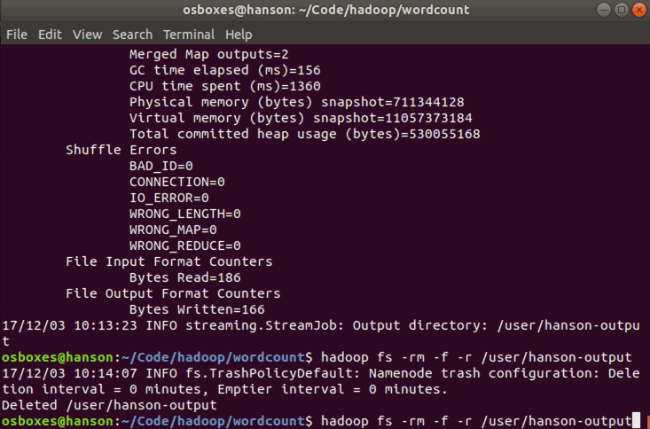

# What we want to do
We will write a simple MapReduce program (see also the MapReduce article on Wikipedia) for Hadoop in Python but without using Jython to translate our code to Java jar files.

Our program will mimick the WordCount, i.e. it reads text files and counts how often words occur. The input is text files and the output is text files, each line of which contains a word and the count of how often it occured, separated by a tab.

The “trick” behind the following Python code is that we will use the [Hadoop Streaming API](http://hadoop.apache.org/docs/r1.1.2/streaming.html#Hadoop+Streaming) (see also the corresponding [wiki entry](http://wiki.apache.org/hadoop/HadoopStreaming)) for helping us passing data between our Map and Reduce code via `STDIN` (standard input) and `STDOUT` (standard output). We will simply use Python’s `sys.stdin` to read input data and print our own output to `sys.stdout`. That’s all we need to do because Hadoop Streaming will take care of everything else!

## Map step: mapper.py
Save the following code in the file `mapper.py`. It will read data from STDIN, split it into words and output a list of lines mapping words to their (intermediate) counts to STDOUT. The Map script will not compute an (intermediate) sum of a word’s occurrences though. Instead, it will output <word> 1 tuples immediately – even though a specific word might occur multiple times in the input. In our case we let the subsequent Reduce step do the final sum count. Of course, you can change this behavior in your own scripts as you please, but we will keep it like that in this tutorial because of didactic reasons. :-)

Make sure the file has execution permission (`chmod +x mapper.py` should do the trick) or you will run into problems.
```bash
#!/usr/bin/python

import sys

# input comes from STDIN (standard input)
for line in sys.stdin:
# remove leading and trailing whitespace
line = line.strip()
# split the line into words
words = line.split()
# increase counters
for word in words:
# write the results to STDOUT (standard output);
# what we output here will be the input for the
# Reduce step, i.e. the input for reducer.py
#
# tab-delimited; the trivial word count is 1
print '%s\t%s' % (word, 1)
```

Then writet a test bench:
```bash
filename="text.txt"
if [ $# -eq 0 ]; then
echo "input null"
else
filename=$1
fi
echo $filename
cat $filename | ./mapper.py
```

You can create any `text.txt` to test the results.
```bash
osboxes@hanson:~/Code/hadoop/wordcount$ ./test_mapper.sh
input null
text.txt
In    1
monotheistic    1
thought,    1
God    1
is    1
believed    1
to    1
be    1
the    1
Supreme    1
Being    1
and    1
the    1
principal    1
object    1
of    1
faith.[3]    1
The    1
concept    1
...
```

## Reduce step: reducer.py
Save the following code in the file `reducer.py`. It will read the results of mapper.py from STDIN (so the output format of mapper.py and the expected input format of reducer.py must match) and sum the occurrences of each word to a final count, and then output its results to STDOUT.

Make sure the file has execution permission (chmod +x reducer.py should do the trick) or you will run into problems.
```bash
#!/usr/bin/python

from operator import itemgetter
import sys

current_word = None
current_count = 0
word = None

# input comes from STDIN
for line in sys.stdin:
# remove leading and trailing whitespace
line = line.strip()

# parse the input we got from mapper.py
word, count = line.split('\t', 1)

# convert count (currently a string) to int
try:
count = int(count)
except ValueError:
# count was not a number, so silently
# ignore/discard this line
continue

# this IF-switch only works because Hadoop sorts map output
# by key (here: word) before it is passed to the reducer
if current_word == word:
current_count += count
else:
if current_word:
# write result to STDOUT
print '%s\t%s' % (current_word, current_count)
current_count = count
current_word = word

# do not forget to output the last word if needed!
if current_word == word:
print '%s\t%s' % (current_word, current_count)
```

You can write a test bench to test your code:
```bash
filename="text.txt"
if [ $# -eq 0 ]; then
echo "input null"
else
filename=$1
fi
# sort operation is the shuffle phase in map-reduce
cat $filename | ./mapper.py | sort -k1,1 | ./reducer.py
```
The output is like this:
```bash
osboxes@hanson:~/Code/hadoop/wordcount$ ./test_mapreducer.sh
input null
a    1
(all-knowing),    1
although    1
an    1
and    7
are    1
as    5
attribute    1
attributes    1
be    3
...
```

# Running the Python Code on Hadoop
## Download example input data
We will use three ebooks from Project Gutenberg for this example:

- [The Outline of Science, Vol. 1 (of 4) by J. Arthur Thomson](http://www.gutenberg.org/etext/20417)
- [The Notebooks of Leonardo Da Vinci](http://www.gutenberg.org/etext/5000)
- [Ulysses by James Joyce](http://www.gutenberg.org/etext/4300)

Download each ebook as text files in Plain Text UTF-8 encoding and store the files in a local temporary directory of choice.

## Copy local example data to HDFS
Before we run the actual MapReduce job, we must first copy the files from our local file system to Hadoop’s HDFS.
```
# create hdfs folder
hadoop fs -mkdir /user/hanson
# copy local file to hdfs
hadoop fs -copyFromLocal outline-of-science.txt /user/hanson
# list the copied file
osboxes@hanson:~/Code/hadoop/wordcount$ hadoop fs -ls /user/hanson
Found 1 items
-rw-r--r--   1 osboxes supergroup     661807 2017-12-02 16:57 /user/hanson/outline-of-science.txt
```

## Run the MapReduce job
Now that everything is prepared, we can finally run our Python MapReduce job on the Hadoop cluster. As I said above, we leverage the Hadoop Streaming API for helping us passing data between our Map and Reduce code via `STDIN` and `STDOUT`.

```bash
hadoop \
jar /home/osboxes/Program/hadoop/share/hadoop/tools/lib/hadoop-streaming-2.7.4.jar \
-mapper "python $PWD/mapper.py" \
-reducer "python $PWD/reducer.py" \
-input "/user/hanson/outline-of-science.txt" \
-output "/user/hanson-output"
```


If you want to do MapReduce job again, you should first delete output file or rename a new output file
```
hadoop fs -rm -f -r /user/hanson-output
```
Here I encounter error:
```bash
Container [pid=11310,containerID=container_1512268292225_0001_02_000001] is running beyond virtual memory limits. Current usage: 353.6 MB of 1.5 GB physical memory used; 4.5 GB of 3.1 GB virtual memory used. Killing container.
```

This is because of limit of virtual memory size. We should configure this property `yarn.nodemanager.vmem-pmem-ratio`:
It's default value is 2.1.( We can see 3.1/1.5 = 2.1).
It means the amount of virtual memory that each Container is allowed.
This can be calculated with:`containerMemoryRequest*vmem-pmem-ratio`.

So add this to `yarn-site.xml`.
```
# yarn-site.xml
<property>
<name>yarn.nodemanager.vmem-pmem-ratio</name>
<value>4</value>
</property>
```



This is the output [results](./output.txt).
# Reference
[Writing an Hadoop MapReduce Program in Python](http://www.michael-noll.com/tutorials/writing-an-hadoop-mapreduce-program-in-python/)
[Hadoop Wiki - ImportantConcepts](https://wiki.apache.org/hadoop/ImportantConcepts)
[Hadoop FileSystemShell](https://hadoop.apache.org/docs/r2.8.0/hadoop-project-dist/hadoop-common/FileSystemShell.html#renameSnapshot)
[Tune Hadoop Cluster to get Maximum Performance (Part 2)](http://crazyadmins.com/tag/tuning-yarn-to-get-maximum-performance/)
[](http://www.srccodes.com/p/article/46/noclassdeffounderror-org-apache-hadoop-service-compositeservice-shell-exitcodeexception-classnotfoundexception)
[Running Hadoop on Ubuntu Linux (Single-Node Cluster)](http://www.michael-noll.com/tutorials/running-hadoop-on-ubuntu-linux-single-node-cluster/#copy-local-example-data-to-hdfs)
