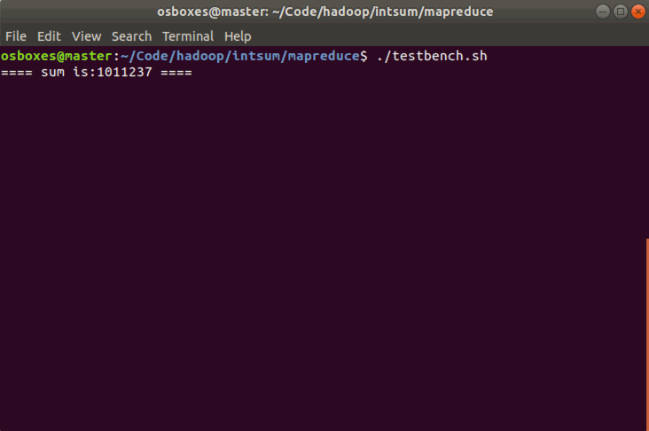
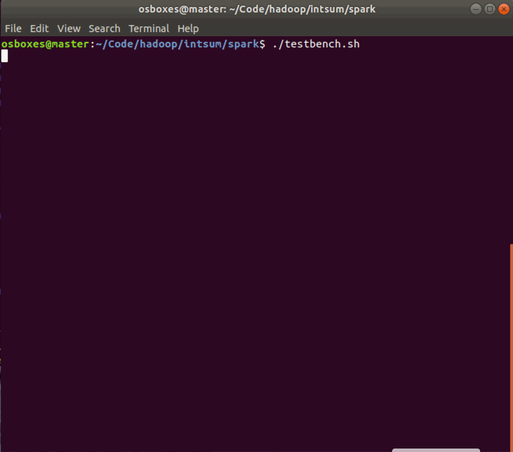

# What we want to do
Before we start, we should first [install hadoop](./Hadoop_Installation.md).

We will write a simple MapReduce program (see also the MapReduce article on Wikipedia) for Hadoop in Python but without using Jython to translate our code to Java jar files.

Our program will mimick the WordCount, i.e. it reads text files and counts how often words occur. The input is text files and the output is text files, each line of which contains a word and the count of how often it occured, separated by a tab.

The “trick” behind the following Python code is that we will use the [Hadoop Streaming API](http://hadoop.apache.org/docs/r1.1.2/streaming.html#Hadoop+Streaming) (see also the corresponding [wiki entry](http://wiki.apache.org/hadoop/HadoopStreaming)) for helping us passing data between our Map and Reduce code via `STDIN` (standard input) and `STDOUT` (standard output). We will simply use Python’s `sys.stdin` to read input data and print our own output to `sys.stdout`. That’s all we need to do because Hadoop Streaming will take care of everything else!

## Map step: mapper.py
Save the following code in the file `mapper.py`. It will read data from STDIN, split it into words and output a list of lines mapping words to their (intermediate) counts to STDOUT. The Map script will not compute an (intermediate) sum of a word’s occurrences though. Instead, it will output <word> 1 tuples immediately – even though a specific word might occur multiple times in the input. In our case we let the subsequent Reduce step do the final sum count. Of course, you can change this behavior in your own scripts as you please, but we will keep it like that in this tutorial because of didactic reasons. :-)

Make sure the file has execution permission (`chmod +x mapper.py` should do the trick) or you will run into problems.

```python
#!/usr/bin/python

import sys

# input comes from STDIN (standard input)
for line in sys.stdin:
    # remove leading and trailing whitespace
    line = line.strip()
    # split the line into words
    words = line.split()
    # increase counters
    for word in words:
        # write the results to STDOUT (standard output);
        # what we output here will be the input for the
        # Reduce step, i.e. the input for reducer.py
        #
        # tab-delimited; the trivial word count is 1
        print '%s\t%s' % (word, 1)
```

Then writet a test bench:

```bash
filename="text.txt"
if [ $# -eq 0 ]; then
echo "input null"
else
filename=$1
fi
echo $filename
cat $filename | ./mapper.py
```

You can create any `text.txt` to test the results.
```bash
osboxes@hanson:~/Code/hadoop/wordcount$ ./test_mapper.sh
input null
text.txt
In    1
monotheistic    1
thought,    1
God    1
is    1
believed    1
to    1
be    1
the    1
Supreme    1
Being    1
and    1
the    1
principal    1
object    1
of    1
faith.[3]    1
The    1
concept    1
...
```

Optional combiner step

In the above example of word counting, a key-value pair is emitted for every word found.
Between the mapping and reduction steps, a shuffle and sort step on the key-value pairs occurs. If the number of intermediate key-value pairs is extremely large, the MapReduce job can
have a very time consuming Shuffle step which can be reduced by performing local aggregation.
Namely, a dictionary of word frequencies per each document can be added so that only distinct word counts per document are emitted:

```python
#!/usr/bin/python

import sys
word_cnts = dict()
# input comes from STDIN (standard input)
for line in sys.stdin:
    #for each document create dictionary of words
    line = line.strip()
    words = line.split()
    for word in words:
        if word not in word_cnts.keys(): word_cnts[word] = 1
        else: word_cnts[word] += 1

# emit key-value pairs only for distinct words per document
for w in word_cnts.keys():
    print '%s\t%s' % (w,word_cnts[w])
```

## Reduce step: reducer.py
Save the following code in the file `reducer.py`. It will read the results of mapper.py from STDIN (so the output format of mapper.py and the expected input format of reducer.py must match) and sum the occurrences of each word to a final count, and then output its results to STDOUT.

Make sure the file has execution permission (chmod +x reducer.py should do the trick) or you will run into problems.

```python
#!/usr/bin/python

from operator import itemgetter
import sys

current_word = None
current_count = 0
word = None

# input comes from STDIN
for line in sys.stdin:
    # remove leading and trailing whitespace
    line = line.strip()

    # parse the input we got from mapper.py
    word, count = line.split('\t', 1)

    # convert count (currently a string) to int
    try:
        count = int(count)
    except ValueError:
        # count was not a number, so silently
        # ignore/discard this line
        continue

    # this IF-switch only works because Hadoop sorts map output
    # by key (here: word) before it is passed to the reducer
    if current_word == word:
        current_count += count
    else:
        if current_word:
            # write result to STDOUT
            print '%s\t%s' % (current_word, current_count)
        current_count = count
        current_word = word

# do not forget to output the last word if needed!
if current_word == word:
    print '%s\t%s' % (current_word, current_count)
```

You can write a test bench to test your code:
```bash
filename="text.txt"
if [ $# -eq 0 ]; then
echo "input null"
else
filename=$1
fi
# sort operation is the shuffle phase in map-reduce
cat $filename | ./mapper.py | sort -k1,1 | ./reducer.py
```
The output is like this:
```bash
osboxes@hanson:~/Code/hadoop/wordcount$ ./test_mapreducer.sh
input null
a    1
(all-knowing),    1
although    1
an    1
and    7
are    1
as    5
attribute    1
attributes    1
be    3
...
```

# Running the Python Code on Hadoop
## Download example input data
We will use three ebooks from Project Gutenberg for this example:

- [The Outline of Science, Vol. 1 (of 4) by J. Arthur Thomson](http://www.gutenberg.org/etext/20417)
- [The Notebooks of Leonardo Da Vinci](http://www.gutenberg.org/etext/5000)
- [Ulysses by James Joyce](http://www.gutenberg.org/etext/4300)

Download each ebook as text files in Plain Text UTF-8 encoding and store the files in a local temporary directory of choice.

## Copy local example data to HDFS
Before we run the actual MapReduce job, we must first copy the files from our local file system to Hadoop’s HDFS.
```bash
# create hdfs folder
hadoop fs -mkdir /user/data
# copy local file to hdfs
hadoop fs -copyFromLocal outline-of-science.txt /user/data
# list the copied file
osboxes@hanson:~/Code/hadoop/wordcount$ hadoop fs -ls /user/data
Found 1 items
-rw-r--r--   1 osboxes supergroup     661807 2017-12-02 16:57 /user/data/outline-of-science.txt
```

## Run the MapReduce job
Now that everything is prepared, we can finally run our Python MapReduce job on the Hadoop cluster. As I said above, we leverage the Hadoop Streaming API for helping us passing data between our Map and Reduce code via `STDIN` and `STDOUT`.

```bash
hadoop \
jar /home/osboxes/Program/hadoop/share/hadoop/tools/lib/hadoop-streaming-2.7.4.jar \
-mapper mapper.py \
-reducer reducer.py \
-input /user/data/outline-of-science.txt \
-output /user/output \
-file mapper.py \
-file reducer.py
```

```bash
osboxes@slave2:~$ fs -cat /user/output/*
...
zoologists,    1
zoophyte.    2
zoophytes    1
zoophytes,    1
zoölogical    1
{    3
{Beginnings    1
{CAMBRIAN    1
{CARBONIFEROUS    1
{CRETACEOUS    1
{Cooling    1
{DEVONIAN    1
{EOCENE    1
{Establishment    1
{JURASSIC    1
{MIOCENE    1
{Making    1
{ORDOVICIAN    1
{PERMIAN    1
{PLEISTOCENE    1
{SILURIAN    1
{TRIASSIC    1
|    136
|________________________________________________________________|    1
|______________________________________|    3
|_________|_______________|____________|____________|____________|    2
§    77
Æschylus    1
Æsop    3
æons    1
æsthetic    1
```

If you want to do MapReduce job again, you should first delete output file or rename a new output file

```bash
hadoop fs -rm -f -r /user/output
```
Here I encounter error:
```bash
Container [pid=11310,containerID=container_1512268292225_0001_02_000001] is running beyond virtual memory limits. Current usage: 353.6 MB of 1.5 GB physical memory used; 4.5 GB of 3.1 GB virtual memory used. Killing container.
```

This is because of limit of virtual memory size. We should configure this property `yarn.nodemanager.vmem-pmem-ratio`:
It's default value is 2.1.( We can see 3.1/1.5 = 2.1).
It means the amount of virtual memory that each Container is allowed.
This can be calculated with:`containerMemoryRequest*vmem-pmem-ratio`.

So add this to `yarn-site.xml`.
```
# yarn-site.xml
<property>
<name>yarn.nodemanager.vmem-pmem-ratio</name>
<value>4</value>
</property>
```


This is the output [results](./output.txt).

# Running the Python Code on Spark
Go to `spark/example/src/main/python` folder:
```bash
spark-submit wordcount.py outline-of-science.txt
```
Then the output should be like this:
```
...
E.g.: 1
ranks: 2
SCOOPING: 2
Golden: 4
blue.: 1
sun--the: 1
Bavaria,: 1
half-second: 1
Evolution_: 1
volumes: 1
vane: 1
function.: 1
expands: 1
struggled.: 1
castings,: 1
17/12/09 00:17:03 INFO ui.SparkUI: Stopped Spark web UI at http://10.211.55.7:4040
17/12/09 00:17:03 INFO spark.MapOutputTrackerMasterEndpoint: MapOutputTrackerMasterEndpoint stopped!
17/12/09 00:17:03 INFO memory.MemoryStore: MemoryStore cleared
17/12/09 00:17:03 INFO storage.BlockManager: BlockManager stopped
17/12/09 00:17:03 INFO storage.BlockManagerMaster: BlockManagerMaster stopped
17/12/09 00:17:03 INFO scheduler.OutputCommitCoordinator$OutputCommitCoordinatorEndpoint: OutputCommitCoordinator stopped!
17/12/09 00:17:03 INFO spark.SparkContext: Successfully stopped SparkContext
17/12/09 00:17:04 INFO util.ShutdownHookManager: Shutdown hook called
17/12/09 00:17:04 INFO util.ShutdownHookManager: Deleting directory /home/osboxes/Program/spark/spark-1aa3c6db-c99f-4a1e-a944-1116b8bc07b1
17/12/09 00:17:04 INFO util.ShutdownHookManager: Deleting directory /home/osboxes/Program/spark/spark-1aa3c6db-c99f-4a1e-a944-1116b8bc07b1/pyspark-74c218da-579c-4f12-99df-4fcb01a9dd6e
```
# intsum example in MapReduce and Spark
First generate [10000 random](./intsum.txt) number from range [1,100]. （ random numbers are generated [here](https://www.random.org/integers/)）
We can check wordcount example using this input:


```
hadoop \
jar /home/osboxes/Program/hadoop/share/hadoop/tools/lib/hadoop-streaming-2.7.4.jar \
-mapper mapper.py \
-reducer reducer.py \
-input /user/data/intsum*.txt \
-output /user/output \
-file mapper.py \
-file reducer.py


osboxes@slave2:~/Code/hadoop/wordcount$ fs -cat /user/output/*
1    94
10    92
100    98
11    90
12    102
13    92
14    114
15    96
16    115
17    97
18    99
19    101
2    87
20    95
...
92    107
93    94
94    84
95    100
96    93
97    88
98    108
99    100
```

spark example:
```
osboxes@slave2:~/Code/hadoop/intsum/spark$ spark-submit wordcount.py intsum.txt
17/12/09 15:04:44 INFO spark.SparkContext: Running Spark version 2.2.0
17/12/09 15:04:45 INFO spark.SparkContext: Submitted application: PythonWordCount
17/12/09 15:04:45 INFO spark.SecurityManager: Changing view acls to: osboxes
17/12/09 15:04:45 INFO spark.SecurityManager: Changing modify acls to: osboxes
17/12/09 15:04:45 INFO spark.SecurityManager: Changing view acls groups to:
17/12/09 15:04:45 INFO spark.SecurityManager: Changing modify acls groups to:
...
17/12/09 15:04:52 INFO scheduler.TaskSchedulerImpl: Removed TaskSet 1.0, whose tasks have all completed, from pool
17/12/09 15:04:52 INFO scheduler.DAGScheduler: ResultStage 1 (collect at /home/osboxes/Code/hadoop/intsum/spark/wordcount.py:41) finished in 0.102 s
17/12/09 15:04:52 INFO scheduler.DAGScheduler: Job 0 finished: collect at /home/osboxes/Code/hadoop/intsum/spark/wordcount.py:41, took 1.154076 s
24: 101
25: 100
26: 94
27: 105
20: 95
...
76: 82
75: 97
74: 109
73: 108
72: 99
71: 101
70: 102
79: 115
78: 91
17/12/09 15:04:52 INFO server.AbstractConnector: Stopped Spark@56120752{HTTP/1.1,[http/1.1]}{0.0.0.0:4040}
17/12/09 15:04:52 INFO ui.SparkUI: Stopped Spark web UI at http://10.211.55.7:4040
17/12/09 15:04:52 INFO spark.MapOutputTrackerMasterEndpoint: MapOutputTrackerMasterEndpoint stopped!
17/12/09 15:04:52 INFO memory.MemoryStore: MemoryStore cleared
17/12/09 15:04:52 INFO storage.BlockManager: BlockManager stopped
17/12/09 15:04:52 INFO storage.BlockManagerMaster: BlockManagerMaster stopped
17/12/09 15:04:52 INFO scheduler.OutputCommitCoordinator$OutputCommitCoordinatorEndpoint: OutputCommitCoordinator stopped!
17/12/09 15:04:52 INFO spark.SparkContext: Successfully stopped SparkContext
17/12/09 15:04:53 INFO util.ShutdownHookManager: Shutdown hook called
17/12/09 15:04:53 INFO util.ShutdownHookManager: Deleting directory /home/osboxes/Program/spark/spark-75ccfe4a-d492-46f8-9473-5efd51a48356/pyspark-89e09e1c-a879-4ec5-a584-5c5ca75fba69
17/12/09 15:04:53 INFO util.ShutdownHookManager: Deleting directory /home/osboxes/Program/spark/spark-75ccfe4a-d492-46f8-9473-5efd51a48356
```

## MapReduce Version
Mapper.py:
```Python
#!/usr/bin/python

import sys
num_cnts = dict()
# input comes from STDIN (standard input)
for line in sys.stdin:
    #for each document create dictionary of numbers
    line = line.strip()
    nums = line.split()
    for num in nums:
        if num not in num_cnts.keys(): num_cnts[num] = 1
        else: num_cnts[num] += 1

# emit key-value pairs only for distinct numbers per document
for w in num_cnts.keys():
    print '%s\t%s' % (w,num_cnts[w])
```

Reducer.py:
```python
#!/usr/bin/python

from operator import itemgetter
import sys

current_number = None
current_count = 0
num = None
tsum = 0
# input comes from STDIN
for line in sys.stdin:
    # remove leading and trailing whitespace
    line = line.strip()

    # parse the input we got from mapper.py
    num, count = line.split('\t', 1)

    # convert count (currently a string) to int
    try:
        count = int(count)
    except ValueError:
        # count was not a number, so silently
        # ignore/discard this line
        continue

    tsum = tsum + int(num) * count

print '==== sum is:%s ====' %(tsum)
```

testbench.sh:
```bash
cat intsum*.txt | python mapper.py | python reducer.py
hadoop fs -rm -R /user/output
hadoop \
jar /home/osboxes/Program/hadoop/share/hadoop/tools/lib/hadoop-streaming-2.7.4.jar \
-mapper mapper.py \
-reducer reducer.py \
-input /user/data/intsum*.txt \
-output /user/output \
-file mapper.py \
-file reducer.py

hadoop fs -cat /user/output/*
```
output:


## Spark Version
Source code:
```python
from __future__ import print_function
import sys
reload(sys)
sys.setdefaultencoding('utf-8')
from operator import add

from pyspark.sql import SparkSession

if __name__ == "__main__":
    if len(sys.argv) != 2:
        print("Usage: intsum <file>", file=sys.stderr)
    exit(-1)

    spark = SparkSession\
            .builder\
            .appName("PythonIntSum")\
            .getOrCreate()

    lines = spark.read.text(sys.argv[1]).rdd.map(lambda r: r[0])
    counts = lines.flatMap(lambda x: x.split()) \
            .map(lambda x: (x, 1)) \
            .reduceByKey(add)
    output = counts.collect()
    int_sum = 0
    for (num, count) in output:
        int_sum = int_sum + int(num) * int(count)
        print("%s: %i" % (num, count)) # every number's count
    print("==== sum is: %d =====" % int_sum) # final result
    spark.stop()
```
testbench:
```bash
spark-submit --master yarn intsum.py /user/data/intsum*.txt
```

output:


# Reference
[Writing an Hadoop MapReduce Program in Python](http://www.michael-noll.com/tutorials/writing-an-hadoop-mapreduce-program-in-python/)
[Hadoop Wiki - ImportantConcepts](https://wiki.apache.org/hadoop/ImportantConcepts)
[Hadoop FileSystemShell](https://hadoop.apache.org/docs/r2.8.0/hadoop-project-dist/hadoop-common/FileSystemShell.html#renameSnapshot)
[Tune Hadoop Cluster to get Maximum Performance (Part 2)](http://crazyadmins.com/tag/tuning-yarn-to-get-maximum-performance/)
[Shell$ExitCodeException - Caused by: java.lang.NoClassDefFoundError](http://www.srccodes.com/p/article/46/noclassdeffounderror-org-apache-hadoop-service-compositeservice-shell-exitcodeexception-classnotfoundexception)
[Running Hadoop on Ubuntu Linux (Single-Node Cluster)](http://www.michael-noll.com/tutorials/running-hadoop-on-ubuntu-linux-single-node-cluster/#copy-local-example-data-to-hdfs)
[Spark Programming Guide](http://spark.apache.org/docs/latest/rdd-programming-guide.html)
[Map-reduce tutorial Developing a Map-reduce application](https://www.princeton.edu/researchcomputing/computational-hardware/hadoop/mapred-tut/)
